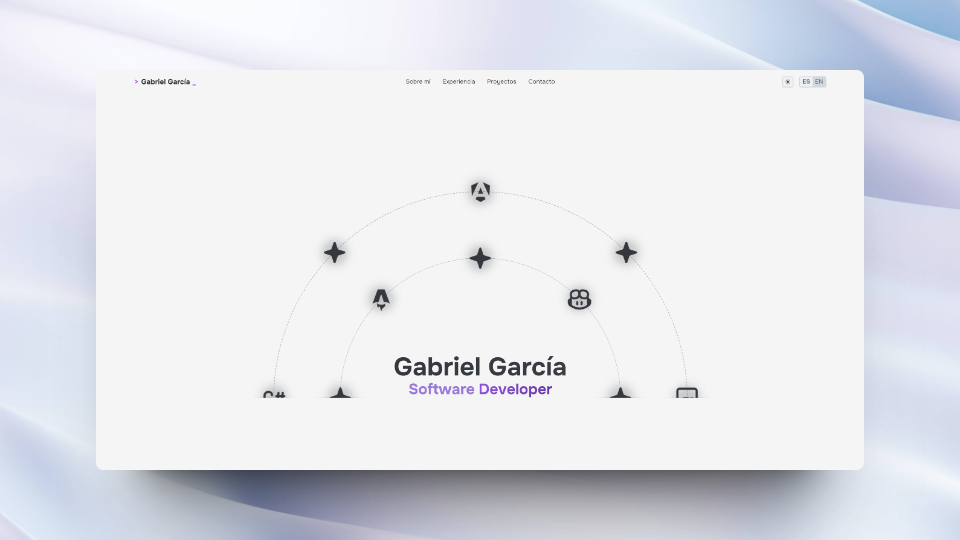

# Gabriel García Pellizzón - Astro portfolio

## Description
This is my portfolio, it's a simple website made with [Astro](https://astro.build/) and [TailwindCSS](https://tailwindcss.com/).

## TODOS

> [!NOTE]  

> Work in progress
- [x] Design Footer :construction: - actually in progress

- [x] Responsive design :construction: - actually in progress
- [x] Design Contact :construction: - actually in progress
- [x] Add sound to buttons
- [x] Add Language switcher
- [x] Add Dark/Light mode
- [x] Add a `README.md` to each project
- [x] Design Header
- [x] Design Home (Orbit component)
- [x] Design About me
- [x] Design Experience
- [x] Design Projects 
- [x] Improve 'Badge' components

## Light mode 💡
